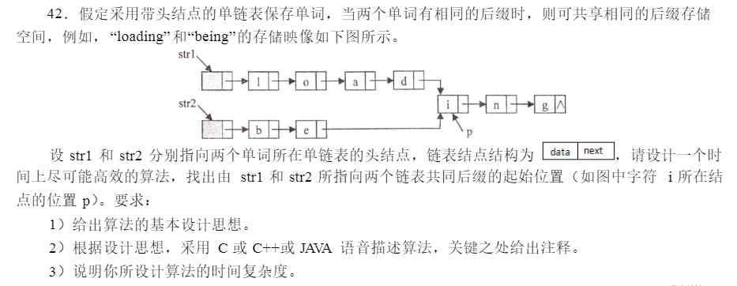

## 一、题目描述



## 二、代码详解

```
#include<stdio.h>
#include<stdlib.h>

typedef struct Node{
	char c;
	struct Node *next;
}Str,*StrPtr;

void init(StrPtr sp1,StrPtr sp2){
	StrPtr temp;
	temp= (StrPtr)malloc(sizeof(Str));
	temp->c='g';
	temp->next=sp1->next;
	sp1->next=sp2->next=temp;
	temp= (StrPtr)malloc(sizeof(Str));
	temp->c='n';
	temp->next=sp1->next;
	sp1->next=sp2->next=temp;
	temp= (StrPtr)malloc(sizeof(Str));
	temp->c='i';
	temp->next=sp1->next;
	sp1->next=sp2->next=temp;
	
	
	temp= (StrPtr)malloc(sizeof(Str));
	temp->c='d';
	temp->next=sp1->next;
	sp1->next=temp;
	temp= (StrPtr)malloc(sizeof(Str));
	temp->c='a';
	temp->next=sp1->next;
	sp1->next=temp;
	temp= (StrPtr)malloc(sizeof(Str));
	temp->c='0';
	temp->next=sp1->next;
	sp1->next=temp;
	temp= (StrPtr)malloc(sizeof(Str));
	temp->c='l';
	temp->next=sp1->next;
	sp1->next=temp;
	
	temp= (StrPtr)malloc(sizeof(Str));
	temp->c='e';
	temp->next=sp2->next;
	sp2->next=temp;
	temp= (StrPtr)malloc(sizeof(Str));
	temp->c='b';
	temp->next=sp2->next;
	sp2->next=temp;
}
//包含头节点 
int getLength(StrPtr sp){
	if(NULL==sp) return 0;
	int count=1;
	while(sp->next!=NULL){
		count++;
		sp=sp->next;
	}
	return count; 
}

StrPtr solution(StrPtr sp1,StrPtr sp2){
	
	int m,n;
	m= getLength(sp1);
	n= getLength(sp2);
	if(m>n){
		for(int i=0;i<m-n;i++)
			sp1=sp1->next;
	}else{
		for(int i=0;i<n-m;i++)
			sp2=sp2->next;
	}
	while(sp1->next!=sp2->next){
		sp1=sp1->next;
		sp2=sp2->next;
	}
	
	return sp1->next;
}


int main(void){
	Str s1;
	Str s2;
	StrPtr s;
	s1.next=s2.next=NULL; 
	init(&s1,&s2);
	
	s=solution(&s1,&s2);
	
	if(s!=NULL) 
		printf("%c\n",s->c);
	
	return 0;
} 
```

