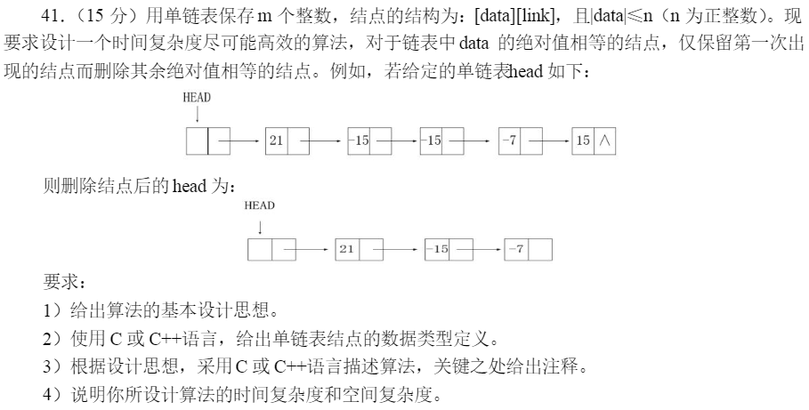

## 一、题目描述



## 二、代码详解

```c++
#include<stdio.h>
#include<stdlib.h>

#define MAX_NUM 100

typedef struct node{
	int number;
	struct node * next;
}LinkedList,*LinkedListPtr; 

// 初始化题目条件
void init(LinkedListPtr p){
	LinkedListPtr temp;
	temp =(LinkedListPtr) malloc(sizeof(LinkedList));
	temp->number = 15;
	temp->next = p->next;
	p->next = temp;
	
	temp =(LinkedListPtr) malloc(sizeof(LinkedList));
	temp->number = -7;
	temp->next = p->next;
	p->next = temp;
	
	temp = (LinkedListPtr)malloc(sizeof(LinkedList));
	temp->number = -15;
	temp->next = p->next;
	p->next = temp;
	
	temp = (LinkedListPtr)malloc(sizeof(LinkedList));
	temp->number = -15;
	temp->next = p->next;
	p->next = temp;
	
	temp = (LinkedListPtr)malloc(sizeof(LinkedList));
	temp->number = 21;
	temp->next = p->next;
	p->next = temp;
} 

void printList(LinkedListPtr p){
	while(p->next!=NULL){
		printf("%d ",p->next->number); 
		p=p->next;
	} 
	printf("\n");
}

void modify(LinkedListPtr p,int maxNum){
	int * arr = (int *)malloc(sizeof(int)*(maxNum)+1);
	for(int i=0;i<=maxNum;i++){
		*(arr+i)=0;
	}
	LinkedListPtr temp;
	while(p->next!=NULL){
		temp =p->next;
		int index = temp->number>=0?temp->number:-temp->number;
		if(*(arr+index)!=1){
			*(arr+index)=1;
			p=p->next;
		}else{
			p->next=temp->next;
			free(temp);
		}
	}
} 

int main(void){
	LinkedList L;
	L.next=NULL;
	init(&L);
	printf("原链表为：\n");
	printList(&L);
	
	modify(&L,MAX_NUM);
	
	printf("修改以后链表为：\n");
	printList(&L);
	
	return 0;
} 

/** 总结 
 *  时间复杂度 o(链表的长度) 
 *  空间复杂度 o(数据绝对值的最大值) 
 */ 
```

